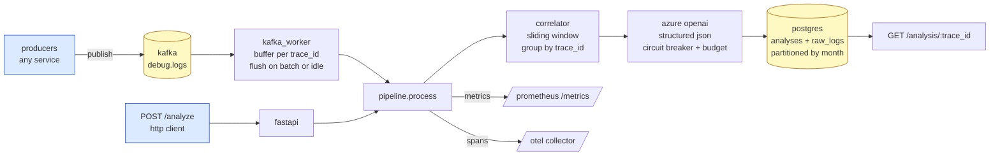

# architecture

## ingestion

two ways in:

- **kafka** (`backend/kafka_worker.py`): consumes from `KAFKA_TOPIC`, buffers per `trace_id`, flushes on `KAFKA_BATCH_MAX` entries or `KAFKA_FLUSH_IDLE_SECONDS` idle. each consumed message is registered in an `OffsetTracker`; commits happen per-partition with the earliest still-unprocessed offset, so a hard kill mid-buffer redelivers exactly the unprocessed traces.
- **http** (`POST /analyze`): bounded by `MAX_LOGS_PER_REQUEST` (default 5000), per-ip rate-limited (sliding window, default 30/min), and runs the same `pipeline.process` as the worker.

## pipeline

`pipeline.process(logs, window_seconds)` is the single async function both paths call:

1. **persist raw_logs** (best-effort: failure is logged and processing continues).
2. **correlate**: group logs by `trace_id`, then expand each trace's window by ±`WINDOW_SECONDS` and pull neighbour logs that fall within.
3. **per bundle**: one llm call. on success, parse structured fields (v3) or best-effort regex (v2). batch all successful results into a single `execute_values` insert at the end.

failure isolation: a per-bundle llm failure doesn't block other bundles; a db save failure doesn't roll back the llm calls already paid for.

## llm

- **AsyncAzureOpenAI** client. retries `RateLimitError` and `APIError` within a single call with exponential backoff.
- **circuit breaker** (`backend/circuit_breaker.py`): trips after `LLM_CB_FAILURE_THRESHOLD` consecutive failures, refuses calls for `LLM_CB_COOLDOWN_SECONDS`, then allows one trial in `half_open`. exposed as `llm_circuit_state` prometheus gauge.
- **daily $ budget** (`backend/budget.py`): estimated from `usage.prompt_tokens`/`completion_tokens` × per-model price table. raises `BudgetExceeded` before calling azure when over. resets at utc midnight. redis-backed when `REDIS_URL` is set.

## storage

- `analyses`: partitioned by `created_at` with monthly partitions and an `analyses_default` catch-all so writes never fail. pk is `(id, created_at)`. partitions for the next ~14 months are pre-created by migration 0004; future months added by `python scripts/create_analysis_partitions.py --months 6`.
- `raw_logs`: not partitioned currently. log retention is the user's responsibility — drop or vacuum as needed.

## observability

- **structured json logs** to stderr. every line carries `ts`, `level`, `logger`, `msg`, plus `request_id` (when set), `trace_id` + `span_id` (when an otel span is active), and any extras passed via `logger.info(..., extra={...})`.
- **prometheus metrics** at `/metrics`: `logs_ingested_total`, `windows_correlated_total`, `llm_calls_total`, `llm_latency_seconds`, `analyses_persisted_total`, `raw_logs_persisted_total`, `bundle_retries_total`, `bundles_dlq_total`, `worker_buffers`, `llm_circuit_state`.
- **otel tracing**: spans around `pipeline.process`, `correlate`, `llm.analyze`, `db.save_*`. fastapi + psycopg2 auto-instrumented.

## hardening

- **multi-stage docker** runtime image runs as non-root `app` user.
- **cors prod profile** with explicit method + header allowlists (no wildcards).
- **generic 500 handler** logs full traceback server-side; clients get `{detail:'internal error', request_id}`.
- **dependabot** weekly grouped pip pr's; **trivy** ci job fails on HIGH/CRITICAL os or library vulns.
